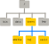

::::::::::::::::::::::::::::::::::::::: objectives

- Distinguish between a file and a directory, explaining their similarities and differences.
- Convert an absolute path to a relative path and vice versa.
- Create absolute and relative paths to pinpoint specific files and directories.
- Apply options and arguments to alter the behavior of a shell command.
- Show how to use tab completion and discuss its benefits.

::::::::::::::::::::::::::::::::::::::::::::::::::

:::::::::::::::::::::::::::::::::::::::: questions

- What methods are available for navigating through my computer?
- How can I view the files and directories I possess?
- What are the ways to identify the location of a file or directory on my computer?

::::::::::::::::::::::::::::::::::::::::::::::::::

:::::::::::::::::::::::::::::::::::::::: instructor

Introducing the shell's filesystem navigation (as detailed in the [Navigating Files and Directories](02-filedir.md) section) can be somewhat perplexing. It might be helpful to have both a terminal and a GUI file explorer open simultaneously. This allows learners to visually compare the file structure and content in the GUI with their actions in the terminal as they navigate the system.

::::::::::::::::::::::::::::::::::::::::::::::::::

The **file system** is a crucial part of the operating system that manages files and directories. It organizes data into files, which store information, and directories (also known as 'folders'), which can contain files or other directories.

To manage these files and directories, several commands are commonly used for creation, inspection, renaming, and deletion. We'll start exploring these by going to our open shell window.

Firstly, let's determine our current location using the `pwd` command, which stands for 'print working directory'. Think of directories as *places*; at any given moment in the shell, we are situated in one specific place, our **current working directory**. Most commands operate on files in the current working directory, meaning 'here', so it's crucial to know your location before executing a command. The `pwd` command helps you identify your current position.

```bash
$ pwd
```

```output
/Users/cecil
```

Here,
the computer's response is `/Users/cecil`,
which is Cecil's **home directory**:


:::::::::::::::::::::::::::::::::::::::::  callout

## Variations in Home Directory Paths

The appearance of the home directory path varies across different operating systems. For instance, on Linux systems, it typically appears as `/home/cecil`, whereas on Windows, it might look like `C:\Documents and Settings\cecil` or `C:\Users\cecil`. It's important to note that there can be slight variations in this path depending on the version of Windows you are using. In our future examples, we'll primarily use outputs from a Mac as a standard reference. Outputs from Linux and Windows may have minor differences but will generally be similar.

We'll proceed with the assumption that when you execute the `pwd` command, it shows your user's home directory. If `pwd` yields a different result, you might need to navigate to your home directory using the `cd` command. Otherwise, certain commands in this lesson might not function as described. For additional information on using the `cd` command to explore other directories, refer to the section [Exploring Other Directories](#exploring-other-directories).


::::::::::::::::::::::::::::::::::::::::::::::::::

To grasp the concept of a 'home directory', it's beneficial to first understand the overall structure of the file system. For illustrative purposes, we'll examine the filesystem on our scientist Cecil's computer. After this explanation, you'll learn how to navigate your own filesystem, which will be structured similarly, though not exactly the same.

Here's an overview of the filesystem on Cecil's computer:

{alt='The file system is an inverted tree structure, with a root directory containing subdirectories like bin, data, users, and tmp'}

The filesystem can be visualized as an inverted tree. At the very top is the **root directory**, which encompasses everything underneath. This root directory is denoted by a solitary slash `/`; it's the same slash found at the beginning of `/Users/cecil`.

Within this root directory are various subdirectories:
- `bin` (housing some built-in programs),
- `data` (for assorted data files),
- `Users` (containing the personal directories of users),
- `tmp` (for temporary files not requiring long-term storage),
- among others.

We know that Cecil's current working directory `/Users/cecil` is a part of `/Users` because it appears at the start of its path. Similarly, the presence of the leading `/` in `/Users` indicates that it resides within the root directory.


:::::::::::::::::::::::::::::::::::::::::  callout

## Understanding the Slash `/`

It's important to recognize the dual role of the `/` character in file paths. When `/` is positioned at the beginning of a file or directory name, it signifies the root directory. However, when `/` is found within a path, it serves merely as a separator between different levels in the directory structure.

::::::::::::::::::::::::::::::::::::::::::::::::::

Under `/Users`, there are directories for each user with an account on Cecil's machine, including his colleagues *Amelia* and *Raj*.

{alt='Home directories are sub-directories under "/Users", such as "/Users/amelia", "/Users/raj", or "/Users/cecil"'}

The files belonging to the user *Amelia* are located in `/Users/amelia`, *Raj*'s files are in `/Users/raj`, and Cecil's are in `/Users/cecil`. In our examples, Cecil is our primary user, so `/Users/cecil` is our home directory. Usually, when you open a new command prompt, you start in your home directory.

Let's now learn the command that allows us to view the contents of our filesystem. We can see what's in our home directory by running `ls`:

```bash
$ ls
```

```output
Applications Documents    Library      Music        Public
Desktop      Downloads    Movies       Pictures
```

(Your results might vary slightly based on your operating system and any customizations you've made to your filesystem.)

The `ls` command displays the names of files and directories in the current directory. We can make this output clearer by using the `-F` **option**, which instructs `ls` to add a specific marker to each file and directory name to indicate its type:

- a trailing `/` signifies a directory
- `@` denotes a link
- `*` marks an executable file

Depending on the settings of your shell, it might also use colors to distinguish files from directories.

```bash
$ ls -F
```

```output
Applications/ Documents/    Library/      Music/        Public/
Desktop/      Downloads/    Movies/       Pictures/
```

Here, we observe that the home directory comprises only **sub-directories**. Any names in the output lacking a classification symbol are **files** within the current working directory.

:::::::::::::::::::::::::::::::::::::::::  callout

## Tidying Up Your Terminal Screen

When your terminal becomes overly crowded, you can tidy it up with the `clear` command. This cleans up the screen but doesn't erase your command history. You can still revisit your past commands by using the <kbd>↑</kbd> and <kbd>↓</kbd> keys to navigate through them one line at a time, or by simply scrolling in your terminal.

::::::::::::::::::::::::::::::::::::::::::::::::::

### Discovering Command Help Options

The `ls` command, like many others, offers a variety of **options** for its use. To learn about these options and how to utilize a command, there are generally two methods, and the next two sections cover each in turn: the `--help` option (Linux and Git Bash) and the `man` command (Linux and macOS). Depending on your system, you might find that only one of them is applicable.


:::::::::::::::::::::::::::::::::::::::::  callout

## Assistance with Built-in Bash Commands

Certain commands are integrated directly into the Bash shell and don't exist as standalone programs in the filesystem. A common example is the `cd` command, used for changing directories. If you encounter a message such as `No manual entry for cd`, an alternative is to use `help cd`. This `help` command provides guidance on using the [Bash built-ins](https://www.gnu.org/software/bash/manual/html_node/Bash-Builtins.html), which are the commands that are part of the shell itself.

::::::::::::::::::::::::::::::::::::::::::::::::::

#### The `--help` option

The majority of Bash commands and programs designed for use in Bash typically support a `--help` option. This feature provides additional details on how to effectively utilize the command or program.

```bash
$ ls --help
```

```output
Usage: ls [OPTION]... [FILE]...
List information about the FILEs (the current directory by default).
Sort entries alphabetically if neither -cftuvSUX nor --sort is specified.

Mandatory arguments to long options are mandatory for short options, too.
  -a, --all                  do not ignore entries starting with .
  -A, --almost-all           do not list implied . and ..
      --author               with -l, print the author of each file
  -b, --escape               print C-style escapes for nongraphic characters
      --block-size=SIZE      scale sizes by SIZE before printing them; e.g.,
                               '--block-size=M' prints sizes in units of
                               1,048,576 bytes; see SIZE format below
  -B, --ignore-backups       do not list implied entries ending with ~
  -c                         with -lt: sort by, and show, ctime (time of last
                               modification of file status information);
                               with -l: show ctime and sort by name;
                               otherwise: sort by ctime, newest first
  -C                         list entries by columns
      --color[=WHEN]         colorize the output; WHEN can be 'always' (default
                               if omitted), 'auto', or 'never'; more info below
  -d, --directory            list directories themselves, not their contents
  -D, --dired                generate output designed for Emacs' dired mode
  -f                         do not sort, enable -aU, disable -ls --color
  -F, --classify             append indicator (one of */=>@|) to entries
...        ...        ...
```

:::::::::::::::::::::::::::::::::::::::::  callout

## Handling Unsupported Command-Line Options

When you attempt to use a command-line option that isn't recognized, commands like `ls` typically respond with an error message. For example, if you try an unsupported option with `ls`, it would look something like this:

```bash
$ ls -j
```

```error
ls: invalid option -- 'j'
Try 'ls --help' for more information.
```

This response indicates that the option you tried is invalid and suggests using the `--help` option to get more information about the command.

::::::::::::::::::::::::::::::::::::::::::::::::::

#### Utilizing the `man` Command

Another method to learn about `ls` is by entering the following command:

```bash
$ man ls
```

Executing this command transforms your terminal into a page displaying a detailed description of the `ls` command and its various options.

While navigating the `man` pages, you can move line-by-line using <kbd>↑</kbd> and <kbd>↓</kbd>. For quicker navigation, <kbd>B</kbd> moves up a full page and <kbd>Spacebar</kbd> moves down a full page. To search for a specific character or word within the `man` pages, press <kbd>/</kbd> followed by your search term. If your search yields multiple results, you can jump between these occurrences with <kbd>N</kbd> (to go forward) and <kbd>Shift</kbd> + <kbd>N</kbd> (to go backward).

To exit the `man` pages, simply press <kbd>Q</kbd>.


:::::::::::::::::::::::::::::::::::::::::  callout

## Accessing Manual Pages Online

Beyond the command-line, there's a third method to find help for Unix commands: using your web browser to search the internet. When searching online, adding `unix man page` to your query can lead to more pertinent results.

Additionally, GNU offers a comprehensive collection of [manuals](https://www.gnu.org/manual/manual.html) online. This includes the [core GNU utilities](https://www.gnu.org/software/coreutils/manual/coreutils.html), which provide detailed information on many of the commands discussed in this lesson.

::::::::::::::::::::::::::::::::::::::::::::::::::


:::::::::::::::::::::::::::::::::::::::  challenge

## Investigating Further Options in `ls`

Try combining two options together.

What outcome does `ls` produce with the `-l` option? 

And what happens when you combine the `-l` option with the `-h` option?

While some of the information provided by these options, like file permissions and ownership, isn't covered in this lesson, the remaining details can still be quite informative.

::::::::::::::::::::::::::::::::::::::::::::::::::

:::::::::::::::  solution

## Solution

Using the `-l` option with `ls` enables a **l**ong format listing. This doesn't just show the names of files or directories but also additional details like file size and the time of the last modification. When you use `-h` along with `-l`, it formats the file size in a '**h**uman readable' manner, presenting sizes like `5.3K` instead of `5369`.

::::::::::::::::::::::::::::::::::::::::::::::::::

:::::::::::::::::::::::::::::::::::::::  challenge


## Sorting Files by Last Modified in Reverse

Normally, `ls` sorts the contents of a directory alphabetically by their names. However, if you use `ls -t`, it sorts files by the time of their last modification, not alphabetically. On the other hand, `ls -r` displays directory contents in reverse order. What file appears last when you use both the `-t` and `-r` options together? Tip: To view the dates of last modifications, you might need to include the `-l` option.

{alt='Sagehen terminal session. ls -j fails with invalid option. ls -l and ls -l -h show long-format listings with permissions, owner, group, and symlinks pointing to /bigdata/lab/awilsonlab. ls -t, ls -r, and ls -t -r -l show the same directory sorted by modification time and in reverse.'}

::::::::::::::::::::::::::::::::::::::::::::::::::

:::::::::::::::  solution

## Solution

When combining `-rt` with `ls`, the file that was most recently modified appears at the end of the list. This sorting method is particularly useful for identifying the latest changes you've made or for verifying whether a new output file has been created.

:::::::::::::::::::::::::

### Navigating Across Different Directories

`ls` isn't limited to just listing the contents of the current working directory. We can also use it to explore the contents of other directories. For example, let's examine what's in our `Desktop` directory by using `ls -F Desktop`, where `ls` is the command, `-F` is an **option**, and `Desktop` is the [**argument**][Arguments]. The `Desktop` argument instructs `ls` to list contents from a directory other than the current one:

```bash
$ ls -F Desktop
```

```output
shell-lesson-data/
```

If you don't have a `Desktop` directory in your current working directory, this command will result in an error. Typically, your home directory contains a `Desktop` directory, which we assume is the current working directory.

You should see a list of files and sub-directories in your Desktop directory, including the `shell-lesson-data` directory downloaded earlier. (In most graphical interfaces, the contents of the `Desktop` directory appear as icons.)

Organizing files into hierarchically structured directories helps keep track of work. Just as piling hundreds of papers on a desk isn't practical, keeping numerous files in the home directory can be equally chaotic.

Knowing that `shell-lesson-data` is on our Desktop, we can do two things:

First, we can view its contents with `ls`, passing the directory name as an argument:

```bash
$ ls -F Desktop/shell-lesson-data
```

```output
exercise-data/  gobekli-tepe-excavation/
```

Second, we can change our current directory. The command `cd`, followed by a directory name, changes our working directory. `cd` stands for 'change directory'. It doesn't change the directory itself but changes the shell's setting of our current directory.

To navigate into the `exercise-data` directory seen above, use these commands:

```bash
$ cd Desktop
$ cd shell-lesson-data
$ cd exercise-data
```

These commands take us from the home directory to the Desktop, then into `shell-lesson-data`, and finally into `exercise-data`. Note that `cd` doesn't produce output when successful. Running `pwd` after `cd` shows we are now in `/Users/cecil/Desktop/shell-lesson-data/exercise-data`.

```bash
$ pwd
```

```output
/Users/cecil/Desktop/shell-lesson-data/exercise-data
```
Running `ls -F` without arguments now lists the contents of `/Users/cecil/Desktop/shell-lesson-data/exercise-data`:

```bash
$ ls -F
```

```output
artifact-catalogs/  excavation-sites/  site-coordinates.txt  pottery-types/  research-notes/
```

To move up a directory (to its parent), you might think to use `cd shell-lesson-data`, but this returns an error:

```bash
$ cd shell-lesson-data
```

```error
-bash: cd: shell-lesson-data: No such file or directory
```

`cd` only recognizes sub-directories within the current directory. To move up, use:

```bash
$ cd ..
```

`..` is a shorthand for the parent directory. Running `pwd` after `cd ..` takes us back to `/Users/cecil/Desktop/shell-lesson-data`:

```bash
$ pwd
```

```output
/Users/cecil/Desktop/shell-lesson-data
```

To see `..` in the `ls` output, use the `-a` option with `ls -F`:

```bash
$ ls -F -a
```

```output
./  ../  exercise-data/  gobekli-tepe-excavation/
```

`-a` (show all) reveals files and directories starting with `.`, such as `..` (the parent directory). It also shows `.` (the current directory). These shortcuts are useful in many scenarios.

Remember, command line tools often allow combining multiple options into a single `-`, like `ls -F -a` being equivalent to `ls -Fa`.

:::::::::::::::::::::::::::::::::::::::::  callout

## Encountering Hidden Files

Beyond the special directories `..` (parent directory) and `.` (current directory), you might encounter a file named `.bash_profile`. This file typically holds configuration settings for the shell. Additionally, there might be other files and directories starting with `.`. These are commonly configuration files for various programs on your computer. The `.`, or dot prefix, is a convention used to keep these configuration files hidden from view in standard directory listings, helping to keep your terminal view uncluttered when you use the basic `ls` command.

::::::::::::::::::::::::::::::::::::::::::::::::::


The fundamental commands for navigating your computer's filesystem are `pwd`, `ls`, and `cd`. Let's delve into some variations of these commands. What happens if you enter `cd` without specifying a directory?

```bash
$ cd
```

To verify what just occurred, use `pwd`:

```bash
$ pwd
```

```output
/Users/cecil
```

It turns out that entering `cd` without any argument takes you back to your home directory. This is a quick way to return to a familiar location if you find yourself lost within your filesystem.

Now, let's go back to the `exercise-data` directory we were in earlier. Previously, we navigated there using three separate commands, but we can actually reach `exercise-data` directly in a single step:

```bash
$ cd Desktop/shell-lesson-data/exercise-data
```

Verify your current location by running `pwd` and `ls -F`.

To move up one level from the `exercise-data` directory, we could use `cd ..`, but there's another method to navigate to any directory, irrespective of your current position.

Until now, we've been using **relative paths** for specifying directories. When a command like `ls` or `cd` is paired with a relative path, it seeks that location from our current spot, not from the filesystem's root.

Alternatively, you can specify a directory's **absolute path**, which includes its full path starting from the root directory. An absolute path is indicated by a leading slash (`/`). This slash directs the system to trace the path from the filesystem's root, ensuring the path is unique regardless of your current directory.

This method allows us to go back to our `shell-lesson-data` directory from any location in the filesystem, including from within `exercise-data`. To determine the absolute path you need, use `pwd` to find your current location and then navigate to `shell-lesson-data`.

```bash
$ pwd
```

```output
/Users/cecil/Desktop/shell-lesson-data/exercise-data
```

```bash
$ cd /Users/cecil/Desktop/shell-lesson-data
```

Confirm your current directory by running `pwd` and `ls -F`, making sure you're where you intended to be.

:::::::::::::::::::::::::::::::::::::::::  callout

## Two Useful Navigation Shortcuts

The shell uses the tilde (`~`) at the start of a path to represent "the current user's home directory". For instance, if Cecil's home directory is `/Users/cecil`, then `~/data` would be the same as `/Users/cecil/data`. Remember, this shortcut only works when it's the first character in the path; a path like `here/there/~/elsewhere` does *not* resolve to `here/there/Users/cecil/elsewhere`.

Another handy shortcut is the `-` (dash) character. When used with `cd`, it means *the last directory you were in*. This is a quick way to switch back and forth between two directories. For example, if you use `cd -` twice in a row, you'll return to your original directory.

It's important to note the difference between `cd ..` and `cd -`: the former moves you *up* one directory level, while the latter takes you *back* to your previous location.

***

Give it a try!
First, navigate to `~/Desktop/shell-lesson-data` (you should already be there).

```bash
$ cd ~/Desktop/shell-lesson-data
```

Next, move into the `exercise-data/pottery-types` directory:

```bash
$ cd exercise-data/pottery-types
```

Now, if you execute:

```bash
$ cd -
```

you'll find yourself back in `~/Desktop/shell-lesson-data`.
If you run `cd -` once more, you'll return to `~/Desktop/shell-lesson-data/exercise-data/pottery-types`.

::::::::::::::::::::::::::::::::::::::::::::::::::

:::::::::::::::::::::::::::::::::::::::  challenge

## Navigating with Absolute and Relative Paths

If Amanda is currently in `/Users/amelia/data`, which of the following commands can she use to return to her home directory, `/Users/amelia`?

1. `cd .`
2. `cd /`
3. `cd /home/amelia`
4. `cd ../..`
5. `cd ~`
6. `cd home`
7. `cd ~/data/..`
8. `cd`
9. `cd ..`

::::::::::::::::::::::::::::::::::::::::::::::::::

:::::::::::::::  solution

## Solution

1. No: `.` denotes the current directory.
2. No: `/` is the root directory of the filesystem.
3. No: Amanda's home directory is `/Users/amelia`, not `/home/amelia`.
4. Yes: Moves up two levels, placing her in `/Users`, one level above her home directory.
5. Yes: `~` is a shortcut for the user's home directory, `/Users/amelia` in this case.
6. No: This attempts to access a `home` directory within the current directory, not the user's home.
7. Yes: A roundabout method, but it effectively moves to `~/data` then up one level to `~/`.
8. Yes: A direct shortcut to the user's home directory.
9. Yes: Moves up one directory level to `/Users/amelia`.


:::::::::::::::::::::::::::

:::::::::::::::::::::::::::::::::::::::  challenge

## Understanding Relative Path Commands

Referencing the filesystem diagram provided, if the current directory shown by `pwd` is `/Users/thing`, what output will the command `ls -F ../backup` produce?

1. `../backup: No such file or directory`
2. `2012-12-01 2013-01-08 2013-01-27`
3. `2012-12-01/ 2013-01-08/ 2013-01-27/`
4. `original/ pnas_final/ pnas_sub/`

{alt='A directory tree under the Users directory. "/Users" contains "backup" and "thing". "/Users/backup" has "original", "pnas_final", and "pnas_sub". "/Users/thing" contains "backup", and "/Users/thing/backup" holds "2012-12-01", "2013-01-08", and "2013-01-27"'}

::::::::::::::::::::::::::::::::::::::::::::::::::

:::::::::::::::  solution

## Solution

1. No: There is indeed a `backup` directory at `/Users`.
2. No: These are the contents of `/Users/thing/backup`, but `..` goes one level up.
3. No: Same as above; `..` takes us to a higher directory level.
4. Yes: `../backup/` refers to the `backup` directory at `/Users/backup/`.

:::::::::::::::::::::::::

:::::::::::::::::::::::::::::::::::::::  challenge

## Understanding `ls` with Reverse Order

Consider the filesystem diagram provided. If `pwd` shows `/Users/backup`, and the `-r` option makes `ls` list items in reverse order, which command(s) would produce the following output?

```output
pnas_sub/ pnas_final/ original/
```

{alt='Directory tree under the Users directory. "/Users" includes "backup" and "thing"; "/Users/backup" has "original", "pnas_final", and "pnas_sub"; "/Users/thing" contains "backup"; "/Users/thing/backup" holds "2012-12-01", "2013-01-08", and "2013-01-27"'}
1. `ls pwd`
2. `ls -r -F`
3. `ls -r -F /Users/backup`

::::::::::::::::::::::::::::::::::::::::::::::::::

:::::::::::::::  solution

## Solution

1. No: `pwd` is not a directory, but a command that prints the working directory.
2. Yes: Using `ls` without a directory argument lists the contents of the current directory in reverse order.
3. Yes: This explicitly specifies the absolute path to list in reverse order.

:::::::::::::::::::::::::

## Breaking Down a Shell Command's Structure

As we delve deeper into shell commands, options, and arguments, it's beneficial to clarify some terminology using a structured approach.

Let's examine the following example of a shell command and dissect its components:

```bash
$ ls -F /
```

{alt='General syntax of a shell command'}

In this example, `ls` is the **command**. It's accompanied by an **option**, `-F`, and an **argument**, `/`. Options often begin with a single dash (`-`), known as **short options**, or a double dash (`--`), referred to as **long options**. [Options] modify how a command operates, while [Arguments] specify the objects (like files or directories) the command should act upon. Sometimes, both options and arguments are collectively called **parameters**. Commands can be used with multiple options and arguments, but they don't always need to have either.

Options are sometimes called **switches** or **flags**, especially when they don't require an additional argument. In this lesson, however, we'll stick to the term *option*.

Spacing is crucial: each part of the command is separated by spaces. Forgetting a space, like writing `ls-F`, makes the shell look for a command that doesn’t exist. Also, be aware that capitalization matters. For instance, `ls -s` shows the size of files, whereas `ls -S` sorts files by size. Here’s an example:

```bash
$ cd ~/Desktop/shell-lesson-data
$ ls -s exercise-data
```

```output
total 28
 4 artifact-catalogs   4 excavation-sites  12 site-coordinates.txt   4 pottery-types   4 research-notes
```

Note that `ls -s` shows sizes in *blocks*, which vary between different operating systems, so your output might differ from the example.

```bash
$ ls -S exercise-data
```

```output
artifact-catalogs  excavation-sites  pottery-types  research-notes  site-coordinates.txt
```

To summarize, our command `ls -F /` provides a list of files and directories in the root directory `/`. An example output from this command could be:

```bash
$ ls -F /
```

```output
Applications/         System/
Library/              Users/
Network/              Volumes/
```

:::::::::::::::::::::::::::::::::::::::::  callout

### Deciding Between Short and Long Command Options

When you have the choice of using either short or long options for command-line operations:

- When typing commands directly into the shell, use short options. This strategy minimizes keystrokes and speeds up your workflow.
- For scripting purposes, lean towards long options. They provide better clarity and enhance readability, which is crucial as scripts are typically read more frequently than they are written.

::::::::::::::::::::::::::::::::::::::::::::::::::

### Cecil's Pipeline: File Organization

With his knowledge of files and directories, Cecil is set to organize the upcoming files from the protein assay machine.

He creates a directory named `gobekli-tepe-excavation`, reminding him of the data's origin. This directory will house both the data files from the assay machine and his data processing scripts.

Each of Cecil's samples carries a unique ten-character ID following his lab's system, such as 'NENE01729A'. He utilized this ID in his collection log to note the sample's location, time and other details. Thus, he decides to incorporate these IDs into the filenames of each data file. Given that the assay machine outputs plain text, he names his files `NENE01729A.txt`, `NENE01812A.txt`, and so on, with all 1520 files going into the same directory.

Now, in his current directory `shell-lesson-data`, Cecil can view his files with the command:

```bash
$ ls gobekli-tepe-excavation/
```

While this command is a bit lengthy, Cecil can use **tab completion** to let the shell do most of the typing. If he types:

```bash
$ ls gob
```

and presses <kbd>Tab</kbd>, the shell completes the directory name:

```bash
$ ls gobekli-tepe-excavation/
```

Pressing <kbd>Tab</kbd> again doesn't change the output, as multiple possibilities exist. However, pressing <kbd>Tab</kbd> twice will list all the files.

If Cecil then types <kbd>a</kbd> and presses <kbd>Tab</kbd>, the shell will add 'ancient' because both script names start with those characters:

```bash
$ ls gobekli-tepe-excavation/ancient
```

To display these files, he can press <kbd>Tab</kbd> twice again:

```bash
ls gobekli-tepe-excavation/ancient
ancientdiff.sh   ancientstats.sh
```

This feature is known as **tab completion** and is a common convenience across many shell tools.


[Arguments]: https://swcarpentry.github.io/shell-novice/reference.html#argument


:::::::::::::::::::::::::::::::::::::::: keypoints

- The file system is responsible for managing information on the disk.
- Information is stored in files, which are stored in directories (folders).
- Directories can also store other directories, which then form a directory tree.
- `pwd` prints the user's current working directory.
- `ls [path]` prints a listing of a specific file or directory; `ls` on its own lists the current working directory.
- `cd [path]` changes the current working directory.
- Most commands take options that begin with a single `-`.
- Directory names in a path are separated with `/` on Unix, but `\` on Windows.
- `/` on its own is the root directory of the whole file system.
- An absolute path specifies a location from the root of the file system.
- A relative path specifies a location starting from the current location.
- `.` on its own means 'the current directory'; `..` means 'the directory above the current one'.

::::::::::::::::::::::::::::::::::::::::::::::::::


