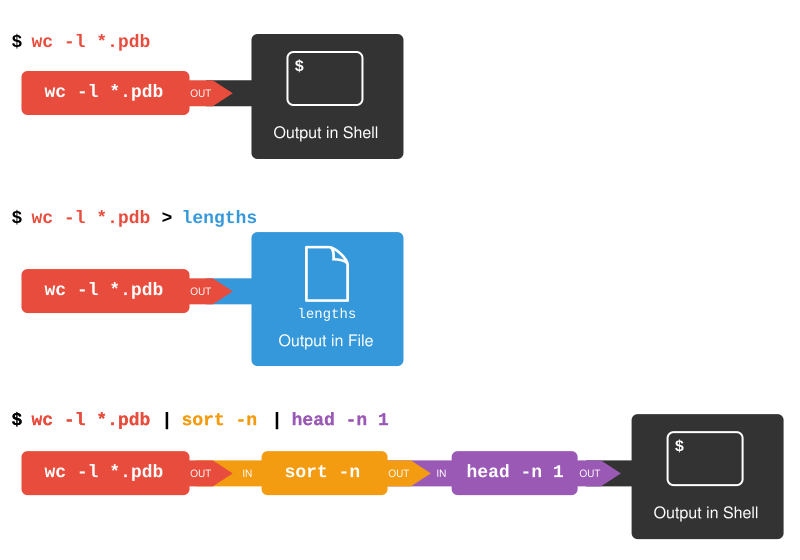

::::::::::::::::::::::::::::::::::::::: objectives

- Learn how to redirect the output of a command into a file.
- Understand how to create command pipelines comprising multiple stages.
- Discuss the typical behavior of programs or pipelines when no input is provided.
- Highlight the benefits of connecting commands using pipes and filters.

::::::::::::::::::::::::::::::::::::::::::::::::::

:::::::::::::::::::::::::::::::::::::::: questions

- How can I use existing commands in combination to perform new tasks?

::::::::::::::::::::::::::::::::::::::::::::::::::

With an understanding of basic commands, we're poised to delve into what truly sets the shell apart: its capability to seamlessly combine programs into novel functions. We'll explore this feature using the `shell-lesson-data/exercise-data/artifact-catalogs` directory, which contains various text files detailing archaeological finds and analyses. The files, identifiable by the `.txt` extension, encompass a range of topics from artifact listings to excavation reports.

```bash
$ ls
```

```output
Animal-Figurines-List.txt  Artifact-Aging-Data.txt  Excavation-Finds-Report.txt
Neolithic-Tools-Inventory.txt  Pillar-Symbols-Analysis.txt  Stone-Carvings-Catalogue.txt
```

For example, let's execute a basic command:

```bash
$ wc Animal-Figurines-List.txt
```

```output
42  314  2537 Animal-Figurines-List.txt
```

Here, `wc` (word count) computes the number of lines, words, and characters within files, listed in that specific order.

Using `wc *.txt` applies the wildcard `*` in `*.txt` to match any sequence of characters, effectively including all `.txt` files in the directory:

```bash
$ wc *.txt
```

```output
  30  246 1858 Animal-Figurines-List.txt
   6   35  251 Artifact-Aging-Data.txt
   5   42  300 Excavation-Finds-Report.txt
   6   32  224 Neolithic-Tools-Inventory.txt
   5   32  240 Pillar-Symbols-Analysis.txt
   5   35  295 Stone-Carvings-Catalogue.txt
  57  422 3168 total
```

This command also provides a total count across all files as its last line of output.

Switching to `wc -l` modifies the command to only display the count of lines per file:

```bash
$ wc -l *.txt
```

```output
  30 Animal-Figurines-List.txt
   6 Artifact-Aging-Data.txt
   5 Excavation-Finds-Report.txt
   6 Neolithic-Tools-Inventory.txt
   5 Pillar-Symbols-Analysis.txt
   5 Stone-Carvings-Catalogue.txt
  57 total
```

Furthermore, `wc` can be paired with `-m` and `-w` options to focus on character counts or word counts, respectively, offering a granular look at the data contained within these archaeological records.

:::::::::::::::::::::::::::::::::::::::::  callout

## Handling Commands Without Input

Ever wondered what happens if you run a command that typically processes a file but don't provide a filename? For instance, consider running:

```bash
$ wc -l
```

without following it with `*.txt` or any input. In such cases, `wc` expects to receive input directly from the command line, leading it to wait for user input interactively. To an observer, it may appear as though the command has stalled or isn't executing any task.

If you find yourself in this situation, you can exit by pressing <kbd>Ctrl</kbd>+<kbd>C</kbd>. This key combination interrupts the current command, allowing you to regain control.

::::::::::::::::::::::::::::::::::::::::::::::::::

## Redirecting Command Output

Among these files, which one has the least number of lines? Answering this becomes challenging with a larger dataset. The initial step towards solving this is:

```bash
$ wc -l *.txt > lengths.txt
```

The `>` symbol instructs the shell to **redirect** the output from `wc` into a file named `lengths.txt` rather than displaying it on the screen. If `lengths.txt` doesn't exist, the shell creates it; if it already exists, the file is overwritten without warning, posing a risk of data loss. Hence, caution is advised with redirection operations.

To verify the file's creation:

```bash
$ ls lengths.txt
```

```output
lengths.txt
```

The contents of `lengths.txt` can be displayed using `cat lengths.txt`, which outputs the file's contents to the screen. The name `cat` comes from 'concatenate', meaning to link things together sequentially. With only one file specified, `cat` simply displays its contents:

```bash
$ cat lengths.txt
```

```output
  30 Animal-Figurines-List.txt
   6 Artifact-Aging-Data.txt
   5 Excavation-Finds-Report.txt
   6 Neolithic-Tools-Inventory.txt
   5 Pillar-Symbols-Analysis.txt
   5 Stone-Carvings-Catalogue.txt
  57 total
```

:::::::::::::::::::::::::::::::::::::::::  callout

## Viewing Output in Manageable Portions

While `cat` is useful for its simplicity and consistency, it's not always practical because it outputs an entire file at once. An alternative is the `less` command (e.g., `less lengths.txt`), which displays the file content a page at a time. You can navigate through the file by pressing the spacebar to move forward a page or `b` to move back. Press `q` to exit the view.

::::::::::::::::::::::::::::::::::::::::::::::::::

## Sorting Output Numerically

We'll now explore how to use the `sort` command to organize the data within the `lengths.txt` file numerically. Before we dive into sorting our file, let's familiarize ourselves with the `sort` command through a quick exercise:

:::::::::::::::::::::::::::::::::::::::  challenge

## Understanding `sort -n` Command

Given the file `shell-lesson-data/exercise-data/numbers.txt` with these contents:

```source
10
2
19
22
6
```

Running `sort` on this file yields:

```output
10
19
2
22
6
```

However, applying `sort -n` to the file changes the output to:

```output
2
6
10
19
22
```

Why does `-n` modify the output in this manner?

:::::::::::::::  solution

## Explanation

The `-n` flag tells `sort` to arrange the lines based on numerical values rather than treating them as text, which leads to a natural numerical order.

:::::::::::::::::::::::::

::::::::::::::::::::::::::::::::::::::::::::::::::

We'll apply the `-n` flag to ensure the `sort` command arranges our `lengths.txt` data numerically. This action doesn't alter the file itself but displays the sorted results:

```bash
$ sort -n lengths.txt
```

```output
   5 Excavation-Finds-Report.txt
   5 Pillar-Symbols-Analysis.txt
   5 Stone-Carvings-Catalogue.txt
   6 Artifact-Aging-Data.txt
   6 Neolithic-Tools-Inventory.txt
  30 Animal-Figurines-List.txt
  57 total
```

To save our sorted data, we redirect the output to a new file, `sorted-lengths.txt`, using `> sorted-lengths.txt`. Afterwards, we can utilize the `head` command to display the top entry in `sorted-lengths.txt`:

```bash
$ sort -n lengths.txt > sorted-lengths.txt
$ head -n 1 sorted-lengths.txt
```

```output
  5 Excavation-Finds-Report.txt
```

The `head -n 1` command specifies that we want only the first line from the file. Since `sorted-lengths.txt` lists file lengths in ascending order, the first line shows the file with the fewest lines.

:::::::::::::::::::::::::::::::::::::::::  callout

## Caution: Redirecting Output to the Same File

Redirecting a command's output back into the same file it operates on is risky:

```bash
$ sort -n lengths.txt > lengths.txt
```

Such an operation can lead to unexpected results or even loss of data in `lengths.txt`.

::::::::::::::::::::::::::::::::::::::::::::::::::

:::::::::::::::::::::::::::::::::::::::  challenge

## Distinguishing Between `>` and `>>`

While `>` is familiar for redirecting output to files, `>>` serves a similar yet distinct purpose. Discover the differences between these operators by using the `echo` command to print text:

```bash
$ echo The echo command prints text
```

```output
The echo command prints text
```

Experiment with the following commands to understand how `>` and `>>` differ:

```bash
$ echo hello > testfile01.txt
```

and:

```bash
$ echo hello >> testfile02.txt
```

Tip: Execute each command twice consecutively and then check the contents of the files.

:::::::::::::::  solution

## Clarifying `>` and `>>`

Using `>` overwrites `testfile01.txt` with 'hello' each time it's executed, resetting the file's contents.

Conversely, `>>` appends 'hello' to `testfile02.txt`, accumulating the output with each execution if the file already exists.

:::::::::::::::::::::::::

::::::::::::::::::::::::::::::::::::::::::::::::::

:::::::::::::::::::::::::::::::::::::::  challenge

## Merging Data with Append

We're already acquainted with the `head` command, which displays the initial segments of files. In contrast, `tail` fetches the file's concluding segments.

Given the file `shell-lesson-data/exercise-data/excavation-sites/Gobekli-Tepe-Site-Data.csv`, predict the result of the following commands and determine what `Gobekli-Tepe-Subset.csv` will contain:

```bash
$ head -n 3 Gobekli-Tepe-Site-Data.csv > Gobekli-Tepe-Subset.csv
$ tail -n 2 Gobekli-Tepe-Site-Data.csv >> Gobekli-Tepe-Subset.csv
```

Options:

1. The top three lines from `Gobekli-Tepe-Site-Data.csv`.
2. The bottom two lines from `Gobekli-Tepe-Site-Data.csv`.
3. The first three lines and the last two lines of `Gobekli-Tepe-Site-Data.csv`.
4. Just the second and third lines of `Gobekli-Tepe-Site-Data.csv`.

:::::::::::::::  solution

## Correct Answer

Option 3 is correct. The initial command writes the first three lines into `Gobekli-Tepe-Subset.csv`. Following this, the second command appends the file's last two lines. The other options do not correctly represent the effects of using `head` and `tail` in conjunction with redirection and appending.

:::::::::::::::::::::::::

::::::::::::::::::::::::::::::::::::::::::::::::::

## Streamlining Command Output

In the process of identifying the file with the fewest lines, we've been using intermediate files like `lengths.txt` and `sorted-lengths.txt` to hold our data, which can be confusing. Simplifying this process involves directly piping `sort` into `head`:

```bash
$ sort -n lengths.txt | head -n 1
```

```output
  9  methane.pdb
```

Here, the pipe `|` allows us to feed the output of `sort` directly as input to `head`, eliminating the need for `sorted-lengths.txt`.

## Linking Commands in a Pipeline

We can extend the concept of piping to connect multiple commands in a sequence without intermediate files. For instance, we can pipe the output of `wc` directly into `sort`, and then into `head`, negating the need for any temporary storage:

First, we pipe `wc`'s output to `sort`:

```bash
$ wc -l *.txt | sort -n
```

{alt='Terminal session in artifact-catalogs. wc *.txt lists line, word, and character counts for six catalog files with a total of 57 lines. The pipeline wc -l *.txt piped to sort -n shows the files ordered by line count with Animal-Figurines-List.txt largest at 30 lines.'}

```output
   5 Excavation-Finds-Report.txt
   5 Pillar-Symbols-Analysis.txt
   5 Stone-Carvings-Catalogue.txt
   6 Artifact-Aging-Data.txt
   6 Neolithic-Tools-Inventory.txt
  30 Animal-Figurines-List.txt
  57 total
```

Next, we funnel that sorted list directly into `head`:

```bash
$ wc -l *.txt | sort -n | head -n 1
```

```output
   5 Excavation-Finds-Report.txt
```

This final command string is akin to applying functions in mathematics, such as *log(3x)*, and means "the smallest line count of `*.txt` files, sorted numerically."

The conceptual flow of these redirections and pipes is captured in the diagram below:

{alt='Illustration showing how output is redirected from "wc -l \*.txt" to the shell, from "wc -l \*.txt > lengths" to a file named "lengths", and how a pipeline from "wc -l \*.txt" through "sort -n" to "head -n 1" directs data through multiple commands before outputting to the shell'}

:::::::::::::::::::::::::::::::::::::::  challenge

## Identifying the Top 3 Shortest Files

In the current directory, we aim to pinpoint the three files with the smallest number of lines. Which of the following commands accomplishes this?

Options:

1. `wc -l * > sort -n > head -n 3`
2. `wc -l * | sort -n | head -n 1-3`
3. `wc -l * | head -n 3 | sort -n`
4. `wc -l * | sort -n | head -n 3`

:::::::::::::::  solution

## Finding the Solution

Option 4 is the correct approach. It uses pipes `|` to seamlessly connect the output from `wc` to `sort` and then to `head`, effectively finding the three files with the least number of lines without creating intermediate files. Options involving `>` incorrectly attempt to redirect output to files instead of chaining commands.

:::::::::::::::::::::::::

::::::::::::::::::::::::::::::::::::::::::::::::::

## Embracing the Unix Philosophy

The Unix philosophy's cornerstone is the concept of chaining small, specialized programs to achieve complex tasks, a model known as 'pipes and filters'. This approach has contributed significantly to Unix's enduring success. Instead of crafting monolithic programs that tackle multiple tasks, Unix developers prioritize creating a suite of simple, focused tools. Each tool excels at a singular function and seamlessly integrates with others. Filters, like `wc` (word count) or `sort`, exemplify this philosophy by taking a stream of input, processing it, and outputting the result. Typically, Unix utilities consume standard input and output their results to standard output unless specified otherwise.

This interoperability principle means any tool that reads text lines from standard input and outputs text lines can be woven with others, enhancing their utility. Adopting this practice in your programming allows you and others to incorporate your tools into pipelines, exponentially increasing their functionality.

:::::::::::::::::::::::::::::::::::::::  challenge

## Understanding Pipelines

Given a file named `Gobekli-Tepe-Site-Data.csv` in the `shell-lesson-data/excavation-sites/` directory with the content:

```source
Site ID, Location, Area (sq. meters), Excavation Start Date, Lead Archaeologist, Notable Finds
GT-01, North Sector, 500, 2020-04-15, Dr. Alex Erdem, Ancient ceremonial relics
GT-02, South Sector, 750, 2021-05-22, Dr. Maria Işık, Neolithic tools and pottery
GT-03, East Sector, 600, 2021-06-18, Dr. Emre Yılmaz, Stone carvings and monoliths
GT-04, West Sector, 650, 2022-03-30, Dr. Leyla Akın, Bronze Age artifacts
GT-05, Central Piazza, 800, 2022-07-15, Dr. Hasan Demir, Ritual sites and animal figurines
```

Can you decipher the flow of text through each pipe and redirection in the following command sequence? Remember, `sort -r` sorts the input in reverse order.

```bash
$ cat Gobekli-Tepe-Site-Data.csv | head -n 5 | tail -n 3 | sort -r > final.txt
```

Tip: Incrementally build up the pipeline to check your understanding.

:::::::::::::::  solution

## Decoding the Pipeline

Initially, `head` selects the first five lines from `Gobekli-Tepe-Site-Data.csv`. Subsequently, `tail` extracts the final three lines from these five. Applying `sort -r` reverses the order of these three lines. The resulting sorted output is then redirected into `final.txt`. To examine the resultant file, use `cat final.txt`, revealing:

```source
GT-04, West Sector, 650, 2022-03-30, Dr. Leyla Akın, Bronze Age artifacts
GT-03, East Sector, 600, 2021-06-18, Dr. Emre Yılmaz, Stone carvings and monoliths
GT-02, South Sector, 750, 2021-05-22, Dr. Maria Işık, Neolithic tools and pottery
```

:::::::::::::::::::::::::

::::::::::::::::::::::::::::::::::::::::::::::::::

## Mastering Command Pipelines

The Unix philosophy emphasizes creating compact, modular tools that accomplish one task well and can be interconnected. This 'pipes and filters' model has fueled Unix's success. In Unix, a **filter** is any program, like `wc` (word count) or `sort`, that takes a stream of input, transforms it, and outputs the result. Most Unix tools default to reading from standard input and writing to standard output unless directed otherwise.

This interoperability principle means that any program reading and writing lines of text can be part of a pipeline, enhancing flexibility and power. Designing your programs to support this model allows you and others to weave these tools into powerful command sequences.

:::::::::::::::::::::::::::::::::::::::  challenge

## Decoding Animal Data

Given the `Gobekli-Tepe-Site-Data.csv` file from earlier, containing various site data, explore how to use the `cut` command to isolate sections of each line:

```bash
$ cut -d , -f 2 Gobekli-Tepe-Site-Data.csv
```

Here, `cut` removes sections from each line, using the comma as a delimiter (`-d ,`), and extracts the second field (`-f 2`). This command outputs location names:

```output
  Location
  North Sector
  South Sector
  East Sector
  West Sector
  Central Piazza
```

To refine this list to unique site data names (in this case they are already unique, but imagine two sites both in South Sector: uniq would remove one of them, leaving a single line), how would you extend this command sequence using `uniq` and another command?

:::::::::::::::  solution

## Unique Data

```bash
$ cut -d , -f 2 Gobekli-Tepe-Site-Data.csv | sort | uniq
```

This sequence cuts out site data names, sorts them (a prerequisite for `uniq`), and then applies `uniq` to list each site data type once.

:::::::::::::::::::::::::

::::::::::::::::::::::::::::::::::::::::::::::::::

:::::::::::::::::::::::::::::::::::::::  challenge

## Identifying Unique site data

Given `Gobekli-Tepe-Site-Data.csv` with multiple entries per location, use commands to count each location occurrences. Consider `uniq`'s `-c` option for counting occurrences. Which command sequence accurately counts each site data type?

1. `sort Gobekli-Tepe-Site-Data.csv | uniq -c`
2. `sort -t, -k2,2 Gobekli-Tepe-Site-Data.csv | uniq -c`
3. `cut -d, -f 2 Gobekli-Tepe-Site-Data.csv | uniq -c`
4. `cut -d, -f 2 Gobekli-Tepe-Site-Data.csv | sort | uniq -c`
5. `cut -d, -f 2 Gobekli-Tepe-Site-Data.csv | sort | uniq -c | wc -l`

:::::::::::::::  solution

## Counting Site Locations

Option 4 accurately counts each locations. It extracts the location names, sorts them, and then counts each occurrence.

:::::::::::::::::::::::::

::::::::::::::::::::::::::::::::::::::::::::::::::

## Cecil's Pipeline: Data Verification

Cecil, working on their `gobekli-tepe-excavation` project, uses the following commands to check their data files:

```bash
$ cd gobekli-tepe-excavation
$ wc -l *.txt
```

Noticing a discrepancy in one file's line count, he investigates further:

```bash
$ wc -l *.txt | sort -n | head -n 5
```

Discovering a file with fewer lines, Cecil deduces it resulted from a machine error. He then checks for excessively long files:

```bash
$ wc -l *.txt | sort -n | tail -n 5
```

Spotting an aberrant 'Z' in a filename, they identify it as a marker for missing information. To find similar cases:

```bash
$ ls *Z.txt
```

Confirming missing data, Cecil opts to exclude these files from his analysis, planning to use specific wildcard expressions for future data selection.

:::::::::::::::::::::::::::::::::::::::  challenge

## Cleanup Processed Data

Imagine wanting to keep only raw data files (`.dat`) and a processing script, removing processed files (`.txt`) to save space. Which command removes only the processed data files?

1. `rm ?.txt`
2. `rm *.txt`
3. `rm * .txt`
4. `rm *.*`

:::::::::::::::  solution

## Removing Processed Files

2. `rm *.txt` is the correct answer, targeting and removing all processed `.txt` files without affecting raw `.dat` files or other content.

:::::::::::::::::::::::::

::::::::::::::::::::::::::::::::::::::::::::::::::

:::::::::::::::::::::::::::::::::::::::: keypoints

- `wc` quantifies lines, words, and characters.
- `cat` displays file contents.
- `sort` organizes input.
- `head` shows the first 10 lines.
- `tail` reveals the last 10 lines.
- `command > [file]` directs output to a file, overwriting existing content.
- `command >> [file]` appends output to a file.
- `[first] | [second]` creates a pipeline, using the output of the first command as input for the second.
- Combining simple, focused programs into pipelines epitomizes the shell's most effective usage.

::::::::::::::::::::::::::::::::::::::::::::::::::


