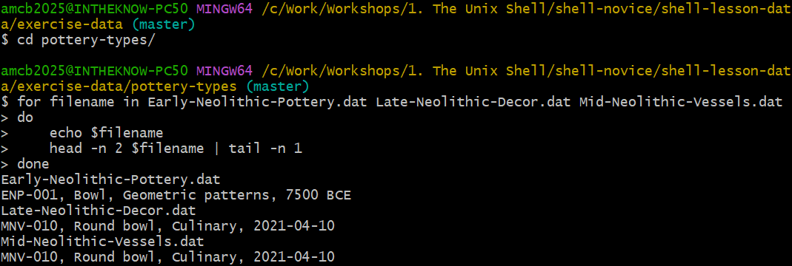
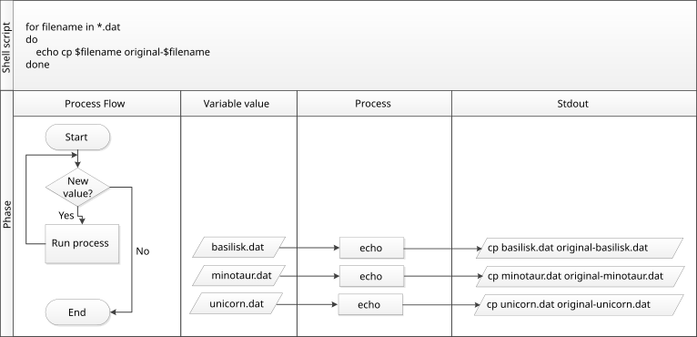

::::::::::::::::::::::::::::::::::::::: objectives

- Construct a loop to execute commands individually on each file within a set.
- Monitor the iteration variable's value throughout the loop's execution.
- Distinguish between a variable's name and its value.
- Understand why it's advised to avoid spaces and certain punctuation in file names.
- Learn how to view and execute recently used commands without retyping them.

::::::::::::::::::::::::::::::::::::::::::::::::::

:::::::::::::::::::::::::::::::::::::::: questions

- How can I automate repetitive tasks across multiple files?

::::::::::::::::::::::::::::::::::::::::::::::::::

**Loops** provide a way to repeat a set of commands for each item in a list, significantly enhancing automation and efficiency. Like wildcards and tab completion, loops help minimize typing and the potential for errors.

Imagine we have numerous genome files such as `Early-Neolithic-Pottery.dat`, `Late-Neolithic-Decor.dat`, and `Mid-Neolithic-Vessels.dat`. Although our example uses the `exercise-data/pottery-types` directory with just three files, the concept is scalable to hundreds or more.

These files share a format: the first three lines contain the common name, classification, and an update date, followed by DNA sequences. To examine these files:

```bash
$ head -n 5 Early-Neolithic-Pottery.dat Late-Neolithic-Decor.dat Mid-Neolithic-Vessels.dat
```

Our goal is to extract and print the classification from the second line of each file. This requires executing `head -n 2` on each file and piping that to `tail -n 1`. To achieve this efficiently, we use a loop, illustrated in this generalized form:

```bash
# "for" initiates the loop
for thing in list_of_things
do
    # Commands within the loop (indentation enhances readability)
    operation_using $thing 
done  
```

Applying this to our task:

```bash
$ for filename in Early-Neolithic-Pottery.dat Late-Neolithic-Decor.dat Mid-Neolithic-Vessels.dat
> do
>     echo $filename
>     head -n 2 $filename | tail -n 1
> done
```

```output
Early-Neolithic-Pottery.dat
ENP-001, Bowl, Geometric patterns, 7500 BCE
Late-Neolithic-Decor.dat
MNV-010, Round bowl, Culinary, 2021-04-10
Mid-Neolithic-Vessels.dat
MNV-010, Round bowl, Culinary, 2021-04-10
```

This demonstrates how loops can streamline the process of performing repetitive tasks on multiple files, making it easier to manage and analyze large datasets.

{alt='Terminal session in exercise-data/pottery-types. A for loop iterates over three .dat files, echoing each filename and printing the second line of each with head piped to tail.'}

:::::::::::::::::::::::::::::::::::::::::  callout

## Understanding Shell Prompts

As we type a loop, the shell prompt changes from `$` to `>` and then back to `$`. The `>` prompt appears to indicate that the command line is incomplete. A semicolon `;` can be used to separate commands when they are entered on the same line.

::::::::::::::::::::::::::::::::::::::::::::::::::

Loops in the shell allow us to execute a command or a group of commands for each item in a list. During each loop iteration, an item from the list is assigned to a **variable**, and the specified commands are executed. To use the value stored in the variable, we precede its name with `$`, signaling to the shell to substitute the variable's name with its value.

In our example, we iterate over a list of filenames: `Early-Neolithic-Pottery.dat`, `Late-Neolithic-Decor.dat`, and `Mid-Neolithic-Vessels.dat`. Each iteration assigns a different filename to the variable `filename` and processes it with `head` and `tail` commands. Initially, `$filename` is `Early-Neolithic-Pottery.dat`, and the loop executes `head` on this file, passing the output to `tail`, which prints its second line. The process repeats for `Late-Neolithic-Decor.dat` and `Mid-Neolithic-Vessels.dat`, with the loop ending after three iterations due to the list's size.

:::::::::::::::::::::::::::::::::::::::::  callout

## Clarifying Symbol Usage

The `>` symbol is used both as a shell prompt and for redirecting output, while `$` is used as a shell prompt and for accessing variable values. When the *shell* displays `>` or `$`, it's prompting for input. When *you* type these symbols, you're instructing the shell to redirect output or retrieve a variable's value.

::::::::::::::::::::::::::::::::::::::::::::::::::

Variables in loops can be named anything that makes the code understandable. While the shell doesn't care about variable names, choosing meaningful names like `filename` instead of `x` or `temperature` helps make the code clearer. Although `${filename}` and `$filename` are functionally identical, using braces (`{}`) around variable names can help delineate them, especially in complex expressions.

Remember, the choice of variable names (`thing`, `filename`, `x`, `temperature`) should always prioritize clarity and meaning to ensure the code remains accessible and understandable to others. Loops are versatile and can be used to process not just filenames but also numbers, data subsets, and more, showcasing the flexibility and power of shell scripting.

:::::::::::::::::::::::::::::::::::::::  challenge

## Crafting a Loop

How would you construct a loop to print the numbers from 0 to 9?

:::::::::::::::  solution

## Crafting the Loop

```bash
$ for number in {0..9}
> do
>     echo $number
> done
```

```output
0
1
2
3
4
5
6
7
8
9
```

:::::::::::::::::::::::::

::::::::::::::::::::::::::::::::::::::::::::::::::

:::::::::::::::::::::::::::::::::::::::  challenge

## Looping Over Files

Given the output from `ls *.txt` in the `shell-lesson-data/exercise-data/artifact-catalogs` directory:

```output
Animal-Figurines-List.txt  Artifact-Aging-Data.txt  Excavation-Finds-Report.txt  Neolithic-Tools-Inventory.txt  Pillar-Symbols-Analysis.txt  Stone-Carvings-Catalogue.txt
```

What would be the result of executing the following scripts?

First script:

```bash
$ for datafile in *.txt
> do
>     ls *.txt
> done
```

Second script:

```bash
$ for datafile in *.txt
> do
>     ls $datafile
> done
```

Why do these two loops produce different outputs?

:::::::::::::::  solution

## Understanding the Output

The first script repeats the listing of all `.txt` files for each iteration of the loop, because `ls *.txt` is evaluated to list all `.txt` files in the directory, regardless of the loop variable.

```output
Animal-Figurines-List.txt  Artifact-Aging-Data.txt  Excavation-Finds-Report.txt  Neolithic-Tools-Inventory.txt  Pillar-Symbols-Analysis.txt  Stone-Carvings-Catalogue.txt
Animal-Figurines-List.txt  Artifact-Aging-Data.txt  Excavation-Finds-Report.txt  Neolithic-Tools-Inventory.txt  Pillar-Symbols-Analysis.txt  Stone-Carvings-Catalogue.txt
Animal-Figurines-List.txt  Artifact-Aging-Data.txt  Excavation-Finds-Report.txt  Neolithic-Tools-Inventory.txt  Pillar-Symbols-Analysis.txt  Stone-Carvings-Catalogue.txt
Animal-Figurines-List.txt  Artifact-Aging-Data.txt  Excavation-Finds-Report.txt  Neolithic-Tools-Inventory.txt  Pillar-Symbols-Analysis.txt  Stone-Carvings-Catalogue.txt
Animal-Figurines-List.txt  Artifact-Aging-Data.txt  Excavation-Finds-Report.txt  Neolithic-Tools-Inventory.txt  Pillar-Symbols-Analysis.txt  Stone-Carvings-Catalogue.txt
Animal-Figurines-List.txt  Artifact-Aging-Data.txt  Excavation-Finds-Report.txt  Neolithic-Tools-Inventory.txt  Pillar-Symbols-Analysis.txt  Stone-Carvings-Catalogue.txt
```

The second script lists each `.txt` file individually per iteration because `$datafile` dynamically represents each `.txt` file in turn as the loop proceeds.

```output
Animal-Figurines-List.txt
Artifact-Aging-Data.txt
Excavation-Finds-Report.txt
Neolithic-Tools-Inventory.txt
Pillar-Symbols-Analysis.txt
Stone-Carvings-Catalogue.txt
```

The difference arises because the first loop does not utilize the loop variable within the loop's body, listing all `.txt` files each time. In contrast, the second loop leverages the loop variable to list each file individually.

:::::::::::::::::::::::::

::::::::::::::::::::::::::::::::::::::::::::::::::

:::::::::::::::::::::::::::::::::::::::  challenge

## Filtering Specific Files for Operation

Within the `shell-lesson-data/exercise-data/artifact-catalogs` directory, evaluate the execution of this loop:

```bash
$ for filename in A*
> do
>     ls $filename
> done
```

Options:

1. No files are listed.
2. All files are listed.
3. Only `Artifact-Aging-Data.txt` is listed.
4. Only `Animal-Figurines-List.txt` and `Artifact-Aging-Data.txt` are listed.

:::::::::::::::  solution

## Identifying the Correct Output

Option 4 is correct. The pattern `A*` matches any file beginning with 'A', resulting in the listing of `Animal-Figurines-List.txt` and `Artifact-Aging-Data.txt`.

:::::::::::::::::::::::::

Considering a modified loop:

```bash
$ for filename in *A*
> do
>     ls $filename
> done
```

Options for its output:

1. The same files as before are listed.
2. All files are listed.
3. No files are listed.
4. Only `Artifact-Aging-Data.txt` is listed.
5. `Animal-Figurines-List.txt` and `Artifact-Aging-Data.txt` are listed.

:::::::::::::::  solution

## Understanding the Outcome

Option 5 correctly identifies the outcome. The pattern `*A*` matches files containing 'A' anywhere in their names, thus listing `Animal-Figurines-List.txt` and `Artifact-Aging-Data.txt`.

:::::::::::::::::::::::::

::::::::::::::::::::::::::::::::::::::::::::::::::

:::::::::::::::::::::::::::::::::::::::  challenge

## Writing to a File Within a Loop

In the `shell-lesson-data/exercise-data/artifact-catalogs` directory, what is the effect of the following loop?

```bash
for item in *.txt
do
    echo $item
    cat $item > combined-logs.txt
done
```

Options:

1. Lists all `.txt` files, saving the content of the first file processed to `combined-logs.txt`.
2. Lists all `.txt` files, combining their contents into `combined-logs.txt`.
3. Lists `Animal-Figurines-List.txt`, `Artifact-Aging-Data.txt`, `Excavation-Finds-Report.txt`, `Neolithic-Tools-Inventory.txt`, `Pillar-Symbols-Analysis.txt`, and `Stone-Carvings-Catalogue.txt`, with only `Stone-Carvings-Catalogue.txt`'s content in `combined-logs.txt`.
4. None of the above.

:::::::::::::::  solution

## Deciphering the Loop's Function

Option 3 is accurate. Each file's name is echoed, but `combined-logs.txt` is overwritten during each iteration, ultimately only containing the content of `Stone-Carvings-Catalogue.txt`.

:::::::::::::::::::::::::

::::::::::::::::::::::::::::::::::::::::::::::::::

:::::::::::::::::::::::::::::::::::::::  challenge

## Combining Files in a Loop

Considering the `shell-lesson-data/exercise-data/artifact-catalogs` directory, assess the result of this loop:

```bash
for file in *.txt
do
    cat $file >> all-records.txt
done
```

Options:

1. Overwrites all-records.txt on each iteration, so it ends up containing only the last file's content.
2. Copies the content of `Artifact-Aging-Data.txt` into `all-records.txt`.
3. Concatenates the content from `Animal-Figurines-List.txt`, `Artifact-Aging-Data.txt`, `Excavation-Finds-Report.txt`, `Neolithic-Tools-Inventory.txt`, `Pillar-Symbols-Analysis.txt`, and `Stone-Carvings-Catalogue.txt` into `all-records.txt`.
4. Displays the content of all `.txt` files on the screen and saves it to `all-records.txt`.

:::::::::::::::  solution

## Clarifying the Correct Action

Option 3 describes the process accurately. The `>>` operator appends the content of each `.txt` file to `all-records.txt`, compiling a comprehensive document without displaying any output to the screen.

:::::::::::::::::::::::::

::::::::::::::::::::::::::::::::::::::::::::::::::

Venturing into the `shell-lesson-data/exercise-data/pottery-types` directory, let's examine a complex loop example:

```bash
$ for pottery in *.dat
> do
>     echo $pottery
>     head -n 100 $pottery | tail -n 20
> done
```

This script begins by identifying all `.dat` files, then employs a combination of commands for processing. Initially, the `echo` command reveals the name of the file under consideration, thus clarifying which file is being processed at any moment. For example, utilizing `echo` to print a message:

```bash
$ echo hello pottery world
```

produces:

```output
hello pottery world
```

In this context, `echo $pottery` prints the name of the current file in the loop. Directly inserting the variable like `$pottery` in a command might inadvertently try to run the file name as a command. The loop smartly extracts lines 81-100 from each file, provided it contains at least 100 lines.

:::::::::::::::::::::::::::::::::::::::::  callout

## Managing Spaces in Filenames

Spaces separate list items in loops. Thus, if an item (such as a file name) contains spaces, it must be encapsulated in quotes, and so should the loop variable when utilized. For filenames incorporating spaces, such as:

```source
Early Neolithic Pottery.dat
Late Neolithic Decor.dat
```

Loop execution would require quotes. (Copies of these two files live in `exercise-data/spaces-demo/`, so you can try this yourself with `cd ../spaces-demo`.)

```bash
$ for filename in "Early Neolithic Pottery.dat" "Late Neolithic Decor.dat"
> do
>     head -n 100 "$filename" | tail -n 20
> done
```

Steering clear of spaces or special characters in filenames eases command application. Without quotes, the `head` command misreads files with spaces in their names, leading to errors.

Testing by excluding quotes around `$filename` in the loop reveals the consequences on filenames with spaces. The absence of quotes generates errors, as the shell misinterprets the filenames:

```output
head: cannot open ‘Early' for reading: No such file or directory
head: cannot open ‘Neolithic' for reading: No such file or directory
head: cannot open ‘Pottery.dat' for reading: No such file or directory
head: cannot open ‘Late' for reading: No such file or directory
...
```

::::::::::::::::::::::::::::::::::::::::::::::::::

To alter files in `shell-lesson-data/exercise-data/pottery-types` while preserving the originals, straightforward copying using wildcards like `cp *.dat original-*.dat` fails due to syntax constraints. Such an attempt triggers an error because `cp` cannot decode `original-*.dat` as a destination directory or file. Instead, a loop facilitates individual file manipulation and renaming:

```bash
$ for file in *.dat
> do
>     cp $file original-$file
> done
```

This method allows for precise operation on each file within the `pottery-types` directory, appending `original-` to the beginning of each file's name to signify a backup copy.

Each iteration copies a file, prefixing the original filename with `original-`, thus preserving originals while enabling modifications. Without output from `cp`, verifying the loop's execution might require manual checks. However, integrating `echo` for command previewing offers a debugging strategy without actual command execution.

Illustrated here, the process underscores the necessity of `echo` for verifying loop commands prior to execution:

{alt='Flow chart explaining the loop execution process, emphasizing the role of `echo` for debugging.'}

## Cecil's Pipeline: Script Execution

Cecil proceeds to analyze their data with `ancientstats.sh`, a script that computes statistics from protein sample files, requiring an input and an output file. Initially, they verify file selection accuracy, focusing on files ending in 'A' or 'B':

```bash
$ cd gobekli-tepe-excavation
$ for file in NENE*A.txt NENE*B.txt
> do
>     echo $file
> done
```

This produces a list of target files. To envision the output filenames, he tweaks the loop to prefix input filenames with 'stats':

```bash
$ for file in NENE*A.txt NENE*B.txt
> do
>     echo $file stats-$file
> done
```

Before running `ancientstats.sh`, they test command generation using `echo`. Once confident, they replace `echo` with the actual script execution command:

```bash
$ for file in NENE*A.txt NENE*B.txt; do bash ancientstats.sh $file stats-$file; done
```

However, the lack of immediate feedback prompts them to reintroduce `echo` for progress monitoring. Adjusting the loop accordingly, they ensure visibility of the ongoing process:

```bash
$ for file in NENE*A.txt NENE*B.txt; do echo $file; bash ancientstats.sh $file stats-$file; done
```

Cecil's adjustments reflect iterative development and testing practices, emphasizing the utility of `echo` for debugging and the iterative refinement of shell commands.

:::::::::::::::::::::::::::::::::::::::::  callout

## Navigating Command History

Quickly move to the command line's beginning with <kbd>Ctrl</kbd>+<kbd>A</kbd> and to the end with <kbd>Ctrl</kbd>+<kbd>E</kbd>. These shortcuts enhance efficiency in command line navigation.

::::::::::::::::::::::::::::::::::::::::::::::::::

Cecil's execution of their data processing script indicates it will complete in about two hours. They verify the output quality in another terminal window and, satisfied, take a well-deserved break.

:::::::::::::::::::::::::::::::::::::::::  callout

## Revisiting Command History

Leveraging `history` to view and execute past commands is another efficient way to repeat tasks. Using `!` followed by the command number from the history list reruns that command, streamlining repetitive tasks.

::::::::::::::::::::::::::::::::::::::::::::::::::

:::::::::::::::::::::::::::::::::::::::::  callout

## Enhancing Command History Interaction

Several shortcuts enhance interaction with the command history:

- <kbd>Ctrl</kbd>+<kbd>R</kbd> initiates a reverse search ('reverse-i-search') to locate the most recent command matching entered text. Press <kbd>Ctrl</kbd>+<kbd>R</kbd> again to find earlier matches. Use the left and right arrow keys to edit the command before execution.
- `!!` fetches the last command executed, offering an alternative to the up-arrow key for repetition.
- `!$` captures the last word of the previous command, useful for quick reference to files or directories in subsequent commands.

::::::::::::::::::::::::::::::::::::::::::::::::::

:::::::::::::::::::::::::::::::::::::::  challenge

## Previewing Loop Commands

To prevent errors when executing loops, especially with file modifications, a "dry run" using `echo` can preview the commands without executing them. Consider wanting to append the contents of several `.pdb` files into `all.txt`. Examine these loop variations for such a preview:

**Version 1:**
```bash
$ for file in *.pdb
> do
>     echo cat $file >> all.txt
> done
```

**Version 2:**
```bash
$ for file in *.pdb
> do
>     echo "cat $file >> all.txt"
> done
```

:::::::::::::::  solution

## Choosing the Correct Version for Preview

The first version is not a true dry run: because the `>>` is left unquoted, bash treats it as real redirection and appends lines like `cat basilisk.pdb` into `all.txt`.

Version 2, however, is the correct dry run: enclosing the command in quotes means `echo` displays it without executing the redirection, so `all.txt` is untouched.

:::::::::::::::::::::::::


:::::::::::::::::::::::::::::::::::::::  challenge

## Organizing Experiments with Nested Loops

Imagine setting up directories for experiments with various compounds and temperatures. Analyze the outcome of executing this nested loop:

```bash
$ for compound in cubane ethane methane
> do
>     for temp in 25 30 37 40
>     do
>         mkdir $compound-$temp
>     done
> done
```

::::::::::::::::::::::::::::::::::::::::::::::::::

:::::::::::::::  solution

## Understanding Nested Loops

This nested loop creates directories for each compound and temperature combination, demonstrating how loops within loops (nested loops) can automate complex directory structures for organizing data.

:::::::::::::::::::::::::

::::::::::::::::::::::::::::::::::::::::::::::::::

:::::::::::::::::::::::::::::::::::::::: keypoints

- A `for` loop executes commands for each item in a list.
- Use a variable within a loop to refer to the current item.
- Expand a variable's value with `$name`, with `${name}` as an alternative syntax.
- Avoid spaces, quotes, and wildcards like '*' or '?' in filenames to simplify command usage.
- Consistent naming and wildcard patterns facilitate file selection for loops.
- Navigate command history with the up-arrow key and <kbd>Ctrl</kbd>+<kbd>R</kbd> for search.
- Repeat commands with `history` and `![number]` based on their history number.

::::::::::::::::::::::::::::::::::::::::::::::::::

