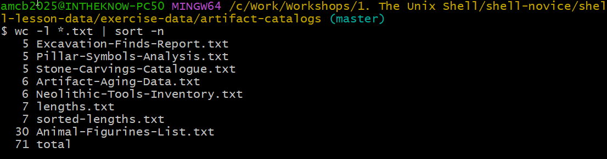

::::::::::::::::::::::::::::::::::::::: objectives

- Craft a shell script that runs a series of commands on a set of files.
- Execute a shell script from the command line.
- Develop a shell script that processes a user-defined set of files specified on the command line.
- Incorporate shell scripts you've created, or those created by others, into your data processing pipelines.

::::::::::::::::::::::::::::::::::::::::::::::::::

:::::::::::::::::::::::::::::::::::::::: questions

- How can I automate and save recurring command sequences for later use?

::::::::::::::::::::::::::::::::::::::::::::::::::
Shell scripts significantly enhance the functionality of the shell by allowing the execution of pre-defined command sequences from a file. This capability speeds up tasks, increases accuracy, and ensures repeatability. Let's practice creating a script for processing data in the `artifact-catalogs/` directory. Begin by creating a script named `extract_notes.sh`:

```bash
$ cd artifact-catalogs
$ nano extract_notes.sh
```

In nano, type in:


```bash
cut -d ',' -f 5 $1
```

{alt='GNU nano editing extract_notes.sh, marked Modified. The only content line is cut -d comma -f 5 dollar 1, with nano's shortcut bar at the bottom.'}

When run, this script will extract the "Notes" column from a comma-separated file. (Our catalog files use commas between columns even though their names end in `.txt`.) Save and exit nano (`Ctrl-O`, `Ctrl-X`), ensuring `extract_notes.sh` is in the `artifact-catalogs` directory.

To execute the script:

```bash
$ bash extract_notes.sh Excavation-Finds-Report.txt
```

Output:

```output
 Notes
 Near ceremonial area
 In burial ground
 Intact
 Fragmented
```

The last two entries are cut short because those Notes themselves contain a comma -- `cut` ends field 5 at the next comma. (The leading space on each line is part of the field, since this file has a space after every comma.)

To make `extract_notes.sh` more versatile, enabling it to process any specified file, modify it in nano to utilize `$1` for the file name:

```bash
cut -d ',' -f 5 "$1"
```

With the quotes around `"$1"`, a filename containing spaces stays together as a single argument: unquoted `$1` would split `my data.csv` into `my` and `data.csv`, while `"$1"` keeps `my data.csv` whole. You can now run the script for any file in the directory:

```bash
$ bash extract_notes.sh Neolithic-Tools-Inventory.txt
```

To further enhance `extract_notes.sh` to include additional arguments for specifying which column to extract, update the script as follows:
```bash
cut -d ',' -f "$2" "$1"
```

Run it with customized arguments:

```bash
$ bash extract_notes.sh Excavation-Finds-Report.txt 5
```

Here `$1` and `$2` are *positional parameters*: `$1` holds the first argument you type after the script name, and `$2` the second. So in `bash extract_notes.sh Excavation-Finds-Report.txt 5`, `$1` is the filename and `$2` is `5`.

Improve the script's usability by adding instructional comments at the top:

```bash
# Extracts a specified column from a comma-separated file.
# Usage: bash extract_notes.sh filename column_number
cut -d ',' -f "$2" "$1"
```

For tasks involving multiple files, such as sorting `.txt` files by their content length:

```bash
$ wc -l *.txt | sort -n
```

{alt='Terminal session running wc -l star dot txt piped to sort -n in artifact-catalogs. Eight text files are listed by ascending line count, including lengths.txt and sorted-lengths.txt created in the earlier episode, with a total of 71 lines.'}

Create a script named `sort_by_length.sh` for a broader application:

```bash
# Sorts files by their line count.
# Usage: bash sort_by_length.sh one_or_more_filenames
wc -l "$@" | sort -n
```

Run `sort_by_length.sh` with several files:

```bash
$ bash sort_by_length.sh *.txt
```

{alt='Terminal session where sort_by_length.sh is edited in nano and then run with bash sort_by_length.sh star dot txt, producing the same sorted listing as the manual pipeline, ending with 30 lines for Animal-Figurines-List.txt and 71 total.'}

This script exemplifies the use of `$@` to handle multiple files, showcasing the shell script's ability to streamline and automate complex command sequences.

:::::::::::::::::::::::::::::::::::::::  challenge

## Script for Listing Unique Artifact Types

Leah has several data files, each formatted with dates, artifact types, and counts. To efficiently compile a list of unique artifact types from these files without manually inputting commands, she decides to write a shell script.

Design a shell script named `unique_artifacts.sh` that accepts an unlimited number of filenames as command-line arguments. The script should display a list of unique artifact types mentioned in each file provided. Each catalog file is comma-separated, with the artifact type in the second column.

:::::::::::::::  solution

## Solution

```bash
# Shell script to list unique artifact types from specified files
# Accepts multiple filenames as command-line arguments

# Iterate through each given file
for file in "$@"
do
    echo "Unique artifact types in $file:"


    # Extract and list unique artifact types
    cut -d ',' -f 2 "$file" | sort | uniq
done
```

{alt='Terminal output with five blocks, each headed Unique artifact types in a catalog filename, listing sorted unique values such as Bone, Charcoal, Bronze spearhead, Arrowhead, and Large monolith. Header words like Material and Description appear among the values because the header row is included.'}

:::::::::::::::::::::::::

::::::::::::::::::::::::::::::::::::::::::::::::::

If we've executed a sequence of commands to produce a particular result, such as a figure for a report, we might want to regenerate this figure later without manually re-entering commands. To achieve this, we can save these commands to a file using:

```bash
$ history | tail -n 5 > redo-figure-3.sh
```

`redo-figure-3.sh` now contains the commands used to generate the figure, but it includes the history command itself and line numbers which we don't need. After a quick edit to clean up these aspects, we're left with a script that can accurately reproduce the figure when executed.

:::::::::::::::::::::::::::::::::::::::  challenge

## Recording Commands in History Before Execution

Consider the behavior where the shell records commands in the command history before they are executed, as demonstrated by:

```bash
$ history | tail -n 5 > recent.sh
```

Why does the shell include the `history` command itself in the history, effectively logging commands before execution?

:::::::::::::::  solution

## Solution

Logging commands before their execution ensures a complete history, even if a command crashes the system or causes a hang. This pre-logging provides valuable context for troubleshooting the last actions before a problem occurred, offering insights into potential causes.

:::::::::::::::::::::::::

::::::::::::::::::::::::::::::::::::::::::::::::::

In practice, shell scripts evolve from command sequences tested at the prompt, gradually becoming saved files for later reuse. This approach allows us to encapsulate discoveries about data and workflow, ensuring reproducibility with minimal effort. Here's a workflow example for creating a reproducible script:

## Cecil's Workflow: Script for Reproducible Analysis

Cecil aims to make their data analysis reproducible. They decide to encapsulate their process in a script, starting in their project's root directory:

```bash
$ cd gobekli-tepe-excavation/
```

They create a script to process data files:

```bash
$ nano do-stats.sh
```

Inside `nano`, they write:

```bash
# Script to perform statistics on data files
for datafile in "$@"
do
    echo Processing $datafile
    bash ancientstats.sh $datafile stats-$datafile
done
```

This script, named `do-stats.sh`, allows Cecil to process files specified at the command line:

```bash
$ bash do-stats.sh NENE*A.txt NENE*B.txt
```

They can even streamline their process further by piping the output to `wc -l` to count the processed files:

```bash
$ bash do-stats.sh NENE*A.txt NENE*B.txt | wc -l
```

Cecil's script is flexible, allowing the user to specify which files to process. This means they aren't confined to a predefined set of files, providing the versatility needed for varied datasets.

:::::::::::::::::::::::::::::::::::::::  challenge
## Variables in Shell Scripts

With a directory named `artifact-catalogs` containing various text files, consider a script named `script.sh` with the content:

```bash
head -n $2 $1
tail -n $3 $1
```

If you run the script within `artifact-catalogs` using:

```bash
$ bash script.sh '*.txt' 1 1
```

What would be the expected outcome?


1. The script outputs all lines except the first and last from each `.txt` file.
2. It shows the first and last lines from each `.txt` file.
3. It displays the first and last lines from every file in the directory.
4. It fails due to the quotes around `*.txt`.

:::::::::::::::  solution

## Solution

Option 2 is the correct answer. The quotes stop the shell from expanding `*.txt` when you *call* the script, so `$1` receives the literal string `*.txt`. But inside the script, `$1` is used *unquoted* -- so when bash substitutes it into `head -n $2 $1`, the wildcard becomes unquoted in that command and the shell expands it *there*, matching every `.txt` file. The script therefore prints the first and the last line of each `.txt` file (with `==> filename <==` headers when several files match). Only if the script used `"$1"` -- quoted -- would the literal `*.txt` reach `head` and fail as option 4 describes. Try both variants to see the difference!

:::::::::::::::::::::::::

::::::::::::::::::::::::::::::::::::::::::::::::::

:::::::::::::::::::::::::::::::::::::::  challenge

## Identifying the Longest File by Extension

Create a script named `longest.sh` that finds the longest file (by line count) with a certain extension within a specified directory. For instance, its usage could be:

```bash
$ bash longest.sh shell-lesson-data/exercise-data/artifact-catalogs txt
```

This command aims to identify the `.txt` file with the most lines within the given directory.

Test the script from inside `artifact-catalogs`, where we have been working -- `.` refers to the current directory:

```bash
$ bash longest.sh . txt
```

:::::::::::::::  solution

## Solution

```bash
# Shell script to locate the longest file of a specified extension in a directory.
wc -l $1/*.$2 | sort -n | tail -n 2 | head -n 1
```

This script calculates line counts for files with the given extension, orders them, and picks the file with the highest line count, excluding the final summary line `wc` produces when handling multiple files.

:::::::::::::::::::::::::

::::::::::::::::::::::::::::::::::::::::::::::::::

:::::::::::::::::::::::::::::::::::::::  challenge

## Script Comprehension for File Operations

Given the `artifact-catalogs` directory with various `.txt` files and potentially other files you've added, analyze what the following three scripts would do when executed as `bash script1.sh *.txt`, `bash script2.sh *.txt`, and `bash script3.sh *.txt`, respectively.

```bash
# Script 1
echo *.*
```

```bash
# Script 2
for filename in $1 $2 $3
do
    cat $filename
done
```

```bash
# Script 3
echo $@.txt
```

:::::::::::::::  solution

## Explanations

For each scenario, the shell expands `*.txt` to a list of matching filenames before passing them as arguments to the script.

Script 1 outputs a list of all files in the directory that contain a period in their names, essentially listing files with extensions. The provided arguments (`*.txt`) are not utilized in the script itself.

Script 2 concatenates and displays the content of the first three `.txt` files specified. `$1`, `$2`, and `$3` reference the first, second, and third command-line arguments, respectively.

Script 3 prints all supplied arguments (i.e., all `.txt` files) followed by `.txt`. Using `$@` signifies all arguments passed to the script, resulting in a redundant `.txt` appended to each filename listed.

```output
Animal-Figurines-List.txt Artifact-Aging-Data.txt Excavation-Finds-Report.txt ... .txt
```

:::::::::::::::::::::::::

::::::::::::::::::::::::::::::::::::::::::::::::::

:::::::::::::::::::::::::::::::::::::::  challenge

## Script Debugging

Imagine you've stored the script below in a file named `do-errors.sh` within Cecil's `gobekli-tepe-excavation` directory:

```bash
# Calculate stats for data files.
for datafile in "$@"
do
    echo $datfile
    bash ancientstats.sh $datafile stats-$datafile
done
```

Executing it from the `gobekli-tepe-excavation` directory like so:

```bash
$ bash do-errors.sh NENE*A.txt NENE*B.txt
```

results in no output.
To diagnose the issue, try running the script again with the `-x` option:

```bash
$ bash -x do-errors.sh NENE*A.txt NENE*B.txt
```

What does the output reveal?
Which specific line is causing the malfunction?

:::::::::::::::  solution

## Solution

Activating the `-x` option puts `bash` into debug mode, displaying each command before it's executed, aiding in pinpointing errors. This case shows that the `echo` command produces no output due to a misspelling in the variable name; `datfile` is undefined, leading to an empty output.

:::::::::::::::::::::::::

::::::::::::::::::::::::::::::::::::::::::::::::::

:::::::::::::::::::::::::::::::::::::::: keypoints

- Shell scripts save commands for later use, enhancing reusability.
- Executing `bash [filename]` runs the saved commands in a file.
- `$@` denotes all command-line arguments passed to a shell script.
- `$1`, `$2`, and so on, refer to the first, second, and subsequent command-line arguments, respectively.
- Enclose variables in quotes to handle values that may contain spaces.
- Allowing users to choose which files to process increases flexibility and aligns with the conventions of Unix commands.

::::::::::::::::::::::::::::::::::::::::::::::::::
